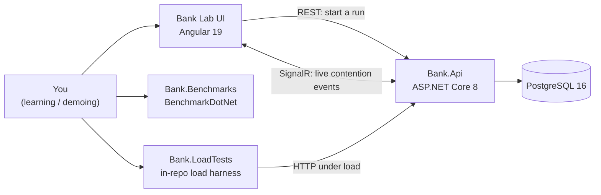
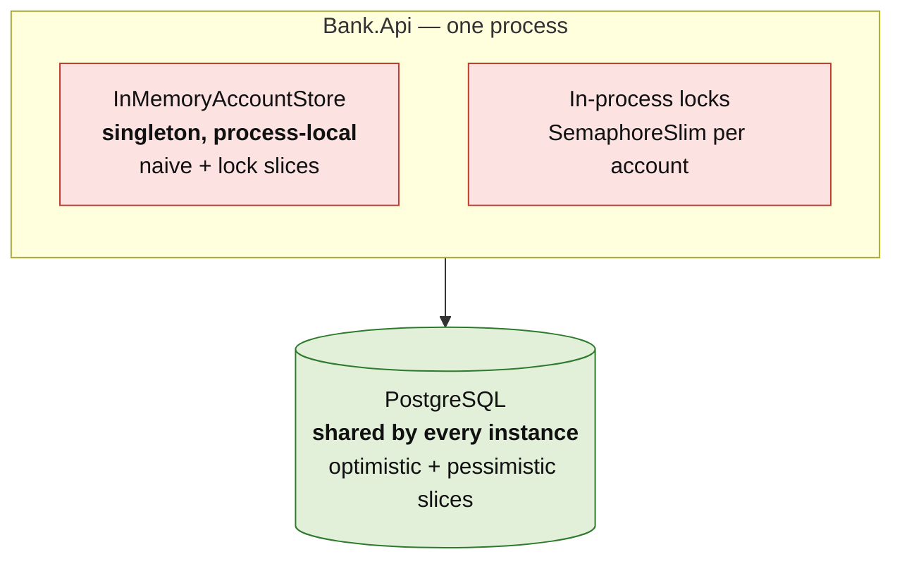
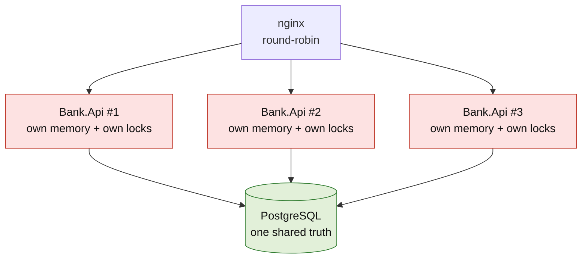
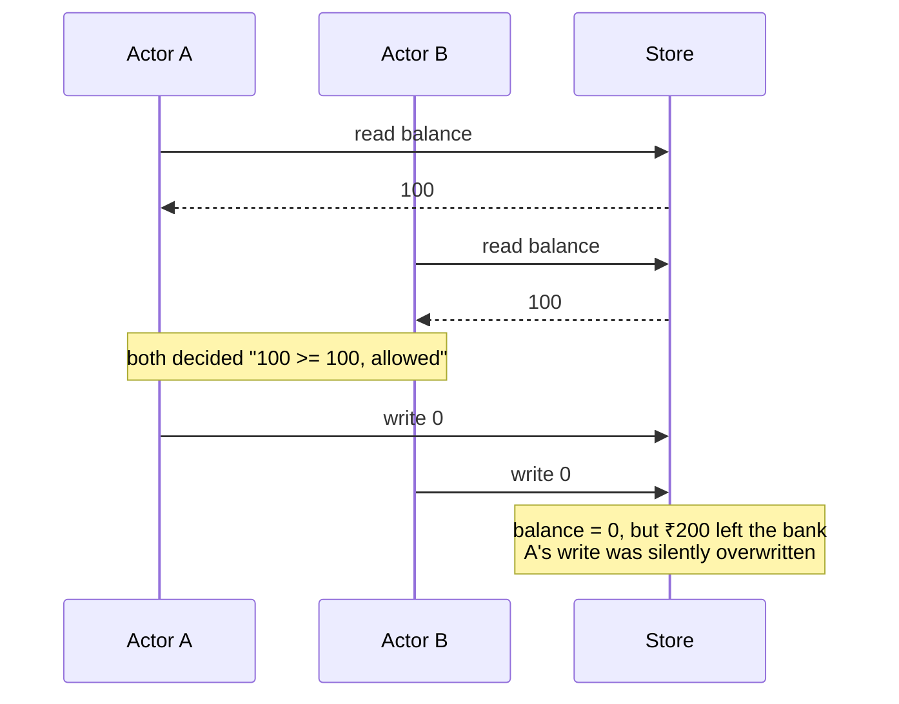
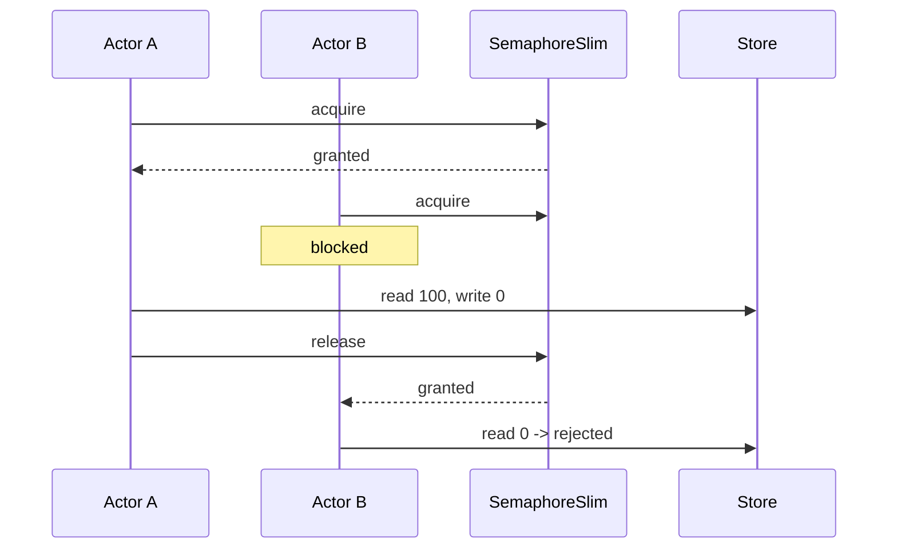
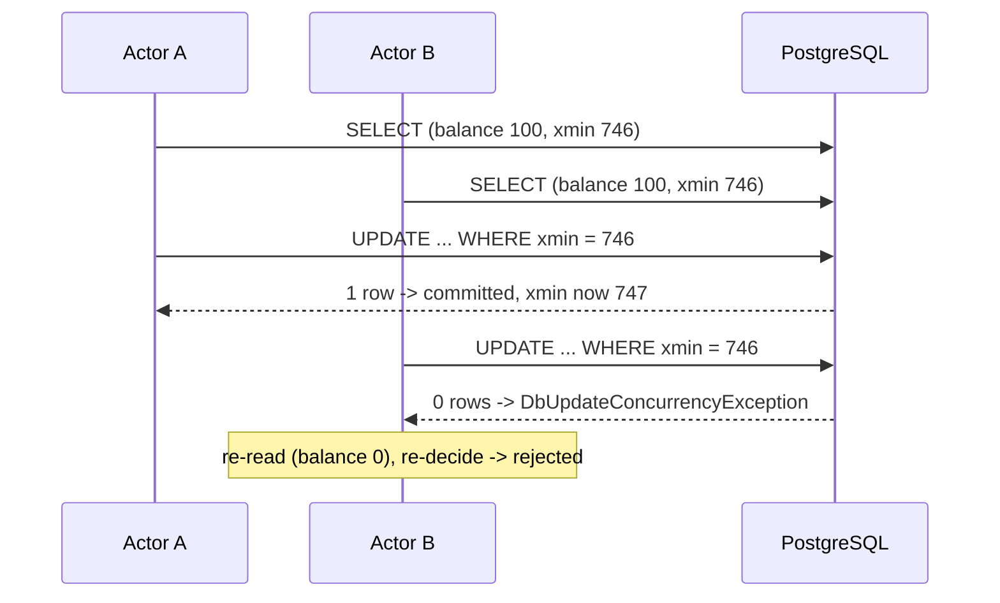
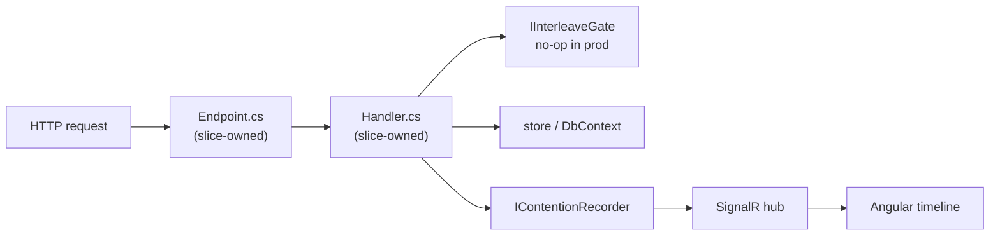

# System overview

One page on the shape of the system: what talks to what, and — the part that matters
for this project — **where mutable state lives**. Almost every concurrency question in
here reduces to that second question.

## Context



`Bank.Benchmarks` measures code *in process* and never touches the API.
`Bank.LoadTests` only ever speaks HTTP. That separation is deliberate and is the
whole of ADR-0010.

## Where state lives

This is the diagram to remember. The two stores behave completely differently the
moment there is more than one instance.



Red boxes are **per process**. Green is **shared**. Scale the app to three instances
and the red boxes are duplicated three times — three separate stores, three separate
sets of locks, coordinating nothing.

## The same system at three replicas



Nothing about the *code* changed between these two diagrams. What changed is that
`lock` now guards one third of the traffic, which is the same as guarding none of it.
The database slices are unaffected, because their coordination point was never in
process memory.

This picture is the answer to "can your app scale?" — see `lessons/09-scaling.md`.

## A contended withdrawal, four ways

Five actors try to withdraw ₹100 each from an account holding ₹100. Only one should
succeed. What follows is what each strategy actually does.

### Naive — the lost update



The gap between read and write is the bug. Nothing here is "simultaneous" — B simply
read a value that was true, and stale by the time it wrote.

### In-process lock — correct, on one instance



Correct — and only because both actors ran in the same process, holding the same
semaphore object.

### Optimistic — detect and retry



Nobody waited. The loser did wasted work and retried. Cheap when conflicts are rare,
increasingly wasteful as they get common.

### Pessimistic — queue up

```mermaid
sequenceDiagram
    participant A as Actor A
    participant B as Actor B
    participant DB as PostgreSQL

    A->>DB: BEGIN; SELECT ... FOR UPDATE
    DB-->>A: row locked, balance 100
    B->>DB: BEGIN; SELECT ... FOR UPDATE
    Note over B: blocked by the row lock
    A->>DB: UPDATE balance = 0; COMMIT
    DB-->>B: unblocked, balance 0
    B->>DB: rejected (insufficient funds); COMMIT
```

Nobody did wasted work. B waited instead. Cheap when conflicts are common, and a
throughput disaster if the transaction is long.

The trade between these last two is ADR-0007 and `lessons/05-choosing-between-them.md`.

## Request path through a slice



Two files per slice, no dispatcher and no pipeline in between (ADR-0002). The
`IInterleaveGate` call is a no-op in production and the reason race tests are
deterministic rather than flaky (ADR-0008).
